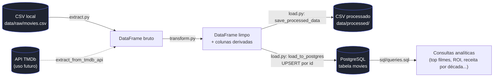

# 🎬 Movie Data Pipeline

Pipeline de **Engenharia de Dados (ETL)** que extrai dados de filmes, realiza limpeza e transformação com **Pandas** e carrega o resultado em um banco **PostgreSQL**, pronto para ser consultado com SQL analítico.

Projeto desenvolvido como peça de portfólio em Engenharia de Dados, com foco em organização de código, modularização, tratamento de erros, logging e testes automatizados — práticas usadas em pipelines de produção reais.


---

## Sumário

- [Objetivo](#objetivo)
- [Arquitetura](#arquitetura)
- [Tecnologias](#tecnologias)
- [Estrutura do projeto](#estrutura-do-projeto)
- [Instalação](#instalação)
- [Execução](#execução)
- [Sobre o dataset](#sobre-o-dataset)
- [Exemplos de consultas SQL](#exemplos-de-consultas-sql)
- [Testes automatizados](#testes-automatizados)
- [Boas práticas adotadas](#boas-práticas-adotadas)
- [Melhorias futuras](#melhorias-futuras)
- [Licença](#licença)

---

## Objetivo

O **Movie Data Pipeline** simula um cenário real de Engenharia de Dados: uma fonte de dados bruta e "suja" (arquivo CSV com duplicados, nulos e registros inválidos) precisa ser extraída, limpa, enriquecida com métricas de negócio e disponibilizada em um banco relacional para análise via SQL.

O pipeline:

1. **Extrai** dados de filmes de um arquivo CSV (com suporte preparado para a API do TMDb);
2. **Transforma** os dados com Pandas: remove duplicados e registros inválidos, trata nulos, converte tipos e cria colunas derivadas (lucro, ROI, década, classificações de receita e nota);
3. **Carrega** o resultado em uma tabela PostgreSQL, usando *upsert* (`INSERT ... ON CONFLICT`) para evitar duplicação de registros entre execuções.

## Arquitetura



Cada seta acima corresponde a um módulo isolado em `src/`, e `src/main.py` é o único arquivo que conhece a ordem completa do fluxo — os módulos de Extract, Transform e Load não se conhecem entre si, apenas trocam DataFrames.

## Tecnologias

| Categoria          | Ferramenta                          |
|---------------------|--------------------------------------|
| Linguagem            | Python 3.10+                          |
| Manipulação de dados | Pandas                                |
| Banco de dados        | PostgreSQL                            |
| ORM / conexão         | SQLAlchemy + psycopg2                 |
| Configuração            | python-dotenv                       |
| Testes                  | Pytest                              |
| Versionamento            | Git / GitHub                        |

## Estrutura do projeto

```
movie-data-pipeline/
│
├── data/
│   ├── raw/                  # Dados brutos (entrada do pipeline)
│   │   └── movies.csv
│   └── processed/            # Dados já tratados (saída da etapa Transform)
│
├── src/
│   ├── extract.py             # Etapa Extract: lê CSV ou API do TMDb
│   ├── transform.py           # Etapa Transform: limpeza e enriquecimento com Pandas
│   ├── load.py                 # Etapa Load: grava CSV processado e faz upsert no PostgreSQL
│   ├── database.py             # Conexão com o banco e execução do schema
│   ├── config.py               # Configurações, paths e variáveis de ambiente
│   └── main.py                  # Orquestra Extract -> Transform -> Load
│
├── sql/
│   ├── schema.sql               # Criação da tabela `movies`
│   └── queries.sql              # As 10 consultas analíticas do projeto
│
├── notebooks/
│   └── exploratory_analysis.ipynb  # Análise exploratória com Pandas/Matplotlib
│
├── tests/
│   ├── test_extract.py
│   └── test_transform.py
│
├── requirements.txt
├── .env.example
├── .gitignore
├── LICENSE
└── README.md
```

## Instalação

```bash
# 1. Clone o repositório
git clone https://github.com/<seu-usuario>/movie-data-pipeline.git
cd movie-data-pipeline

# 2. Crie e ative um ambiente virtual
python3 -m venv venv
source venv/bin/activate        # Windows: venv\Scripts\activate

# 3. Instale as dependências
pip install -r requirements.txt

# 4. Configure as variáveis de ambiente
cp .env.example .env
# edite o .env com as credenciais do seu PostgreSQL local

# 5. Crie o banco de dados (se ainda não existir)
createdb movies_db
```

## Execução

```bash
# Executa o pipeline completo: Extract -> Transform -> Load
python -m src.main
```

Durante a execução, o pipeline:

- registra cada etapa em `logs/etl_pipeline.log` e no console;
- salva o resultado tratado em `data/processed/movies_processed.csv`;
- cria a tabela `movies` no PostgreSQL (caso não exista) e insere/atualiza os registros.

Para rodar apenas as consultas analíticas após a carga:

```bash
psql -d movies_db -f sql/queries.sql
```

## Sobre o dataset

Este repositório inclui em `data/raw/movies.csv` um **dataset sintético** (títulos, diretores e métricas fictícios, gerados programaticamente), criado especificamente para demonstrar o pipeline funcionando de ponta a ponta sem depender de nenhuma fonte externa — incluindo, de propósito, duplicados e valores inválidos para que a etapa de limpeza tenha efeito visível.

Para usar dados reais, basta substituir `data/raw/movies.csv` por um dataset com as mesmas colunas (`id, title, release_date, genres, runtime, budget, revenue, popularity, vote_average, vote_count, original_language`) — por exemplo, um export do [TMDb](https://www.themoviedb.org/) — ou, futuramente, usar `extract_from_tmdb_api()` (já implementada em `src/extract.py`) como fonte direta.

## Exemplos de consultas SQL

Todas as consultas completas estão em [`sql/queries.sql`](sql/queries.sql). Alguns exemplos:

**Top 10 filmes mais lucrativos**
```sql
SELECT title, release_year, budget, revenue, profit
FROM movies
ORDER BY profit DESC
LIMIT 10;
```

**Média das notas por gênero** (a coluna `genres` é "explodida" em linhas com `unnest`)
```sql
SELECT TRIM(genre) AS genre, COUNT(*) AS total_movies, ROUND(AVG(vote_average), 2) AS avg_rating
FROM movies, unnest(string_to_array(genres, ',')) AS genre
GROUP BY TRIM(genre)
ORDER BY avg_rating DESC;
```

**Ranking dos filmes por nota** (usando função de janela para tratar empates)
```sql
SELECT title, vote_average, RANK() OVER (ORDER BY vote_average DESC) AS rating_rank
FROM movies
ORDER BY rating_rank
LIMIT 20;
```

O arquivo completo também inclui: filmes com maior ROI, receita por década, receita por idioma, filmes mais populares, top diretores, média de orçamento por década, e filmes lançados por ano.

## Testes automatizados

```bash
pytest tests/ -v
```

Os testes cobrem as funções puras de `transform.py` (deduplicação, tratamento de nulos, criação de colunas derivadas, classificações) e o comportamento de `extract.py` frente a arquivos inexistentes ou vazios — sem depender de um banco de dados real para rodar.

## Boas práticas adotadas

- **Modularização**: cada etapa do ETL (Extract, Transform, Load) vive em seu próprio módulo, sem dependências cruzadas além do necessário.
- **Type hints** em todas as funções públicas, para legibilidade e suporte de IDEs/linters.
- **Docstrings** detalhadas explicando o propósito, os argumentos e as decisões de design de cada função — não apenas "o que" o código faz, mas "por quê".
- **Tratamento de erros explícito** com `try/except` em pontos de falha realistas (arquivo ausente, CSV vazio, falha de conexão com o banco), sempre acompanhado de log antes de propagar a exceção.
- **Logging estruturado** (console + arquivo) em vez de `print()`, com níveis de severidade.
- **Idempotência**: o schema usa `CREATE TABLE IF NOT EXISTS` e a carga usa `UPSERT`, então o pipeline pode ser executado várias vezes sem duplicar dados.
- **PEP 8** seguido em toda a base de código.
- **Segredos fora do código**: credenciais via `.env` (ignorado pelo Git), com `.env.example` documentando as variáveis esperadas.

## Melhorias futuras

O projeto foi estruturado para crescer nas seguintes direções:

- **API do TMDb como fonte primária** — `extract_from_tmdb_api()` já está implementada; falta apenas trocar a chamada em `main.py` e configurar `TMDB_API_KEY`.
- **Orquestração com Apache Airflow** — cada etapa (`extract`, `transform`, `load`) já é uma função isolada e sem estado compartilhado implícito, o que facilita transformá-las em tasks de uma DAG.
- **Dashboard interativo** com Streamlit ou Power BI, consumindo diretamente a tabela `movies` no PostgreSQL.
- **Containerização com Docker** (`Dockerfile` + `docker-compose.yml` com um serviço PostgreSQL), eliminando a necessidade de instalar o banco localmente.
- **Cobertura de testes ampliada**, incluindo testes de integração com banco de dados via *testcontainers* ou um banco PostgreSQL efêmero em CI.
- **Normalização do schema**: extrair `genres` para uma tabela de junção (`movie_genres`), caso o volume de dados e a frequência de consultas por gênero justifiquem o ganho de performance sobre a abordagem atual com `unnest`.
- **Pipeline de CI/CD** (GitHub Actions) executando `pytest` e *linters* (`flake8`/`ruff`) a cada push.

## Licença

Distribuído sob a licença MIT. Veja [LICENSE](LICENSE) para mais detalhes.
